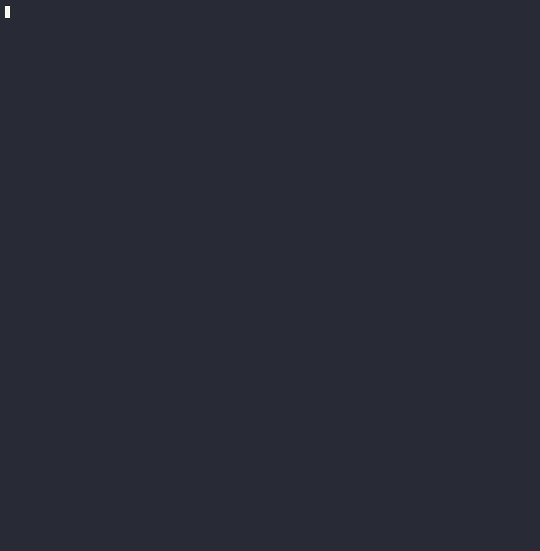
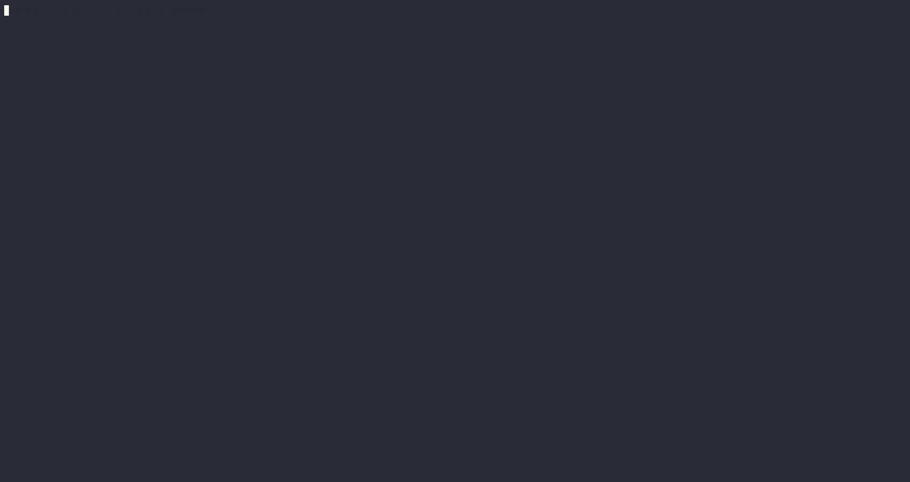

# AsciiArtify Demos

Terminal demos for Kubernetes tooling — recorded with [asciinema](https://asciinema.org).

## Demos

| Demo | Description | Watch |
|------|-------------|-------|
| [ArgoCD Setup](demos/argocd-setup) | Deploy Argo CD and manage Terraform resources via GitOps | `asciinema play demos/argocd-setup/argocd.cast` |
| [Minikube Deploy](demos/minikube-deploy) | Install Minikube and deploy nginx on a local cluster | GIF in folder |

## Quick Start

Clone the repo and play any recording:

```bash
git clone https://github.com/diamonce/AsciiArtify.git
cd AsciiArtify

# Play a demo (install asciinema first: brew install asciinema)
asciinema play demos/argocd-setup/argocd.cast

# Play at 2x speed
asciinema play -s 2 demos/argocd-setup/argocd.cast
```

## Previews

### ArgoCD Setup


### Minikube Deploy


## Documentation

- [Concept](doc/Concept.md) — Comparing Minikube, Kind, and k3d
- [POC](doc/POC.md) — ArgoCD login and password setup
- [MVP](doc/MVP.md) — Terraform + ArgoCD implementation story

## Adding a New Demo

1. Create a folder under `demos/` (e.g. `demos/my-demo`)
2. Record: `asciinema rec demos/my-demo/demo.cast`
3. Add a `README.md` inside the folder
4. Update this table
